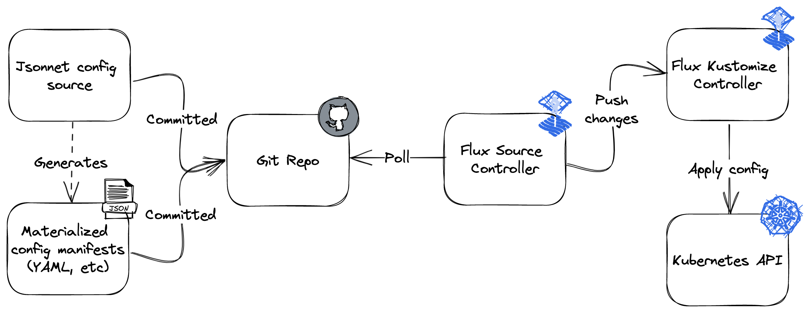

# pbcloud

This is a megarepo containing all of my Kubernetes and other cloud
configuration.

## Design

Configs are written in Jsonnet in the [`source`](source) directory, which are
then materialized into an application-consumable format in the
[`materialized`](materialized) directory. For example, Kubernetes configs
materialize to directories of YAML files. Both the source and materialized
configs are committed to version control.

Here is the basic lifecycle of a Kubernetes config:

## TODOs

FIXME: Major problems with SOPS decryption not working in "many-ks" structure
- Might have to reneg on the .bootstrap strategy
- CRDs are installed via `gotk-compoments.yaml` via kubectl
- GitRepository and Kustomization are installed via `gotk-sync.yaml` via kubectl
